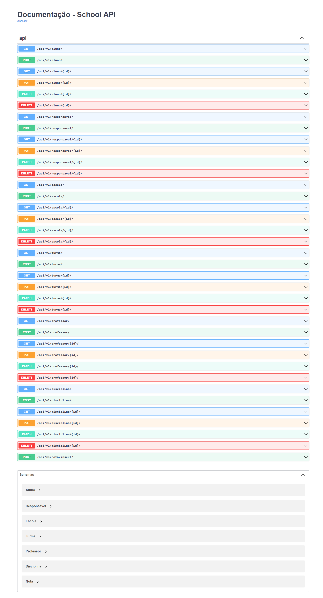

# School API


## Acesso
Para facilitar o acesso a aplicação para testes, ela foi disponilizada utilizando a
plataforma Heroku e pode ser acessada em:
* https://school-api-drf.herokuapp.com/ (raiz - redireciona para documentação)
* https://school-api-drf.herokuapp.com/docs/ (documentação)
* https://school-api-drf.herokuapp.com/api/v1/ (raiz da api)


## Objetivo do sistema
* API que seja capaz de armazenar dados de estudantes no sistema;
* Criar endpoints para: criar, listar, alterar, remover e filtrar estudantes.

## Informações do Projeto

### Principais Tecnologias Utilizadas
* Python
* Django
* Django Rest Framework
* PostgreSQL
* Pytest
* Coverage
* Flake8 (linter)
* Docker/docker-compose
* Github Actions (CI/CD)
* Heroku

### Modelo do Banco de Dados


### Documentação da API

Para facilitar a utilização da API, foi utilizada a ferramenta Swagger para gerar uma página
onde é possível conferir e executar todos os endpoints disponíveis.

URL da Documentação: https://school-api-drf.herokuapp.com/docs/



## Instalação em ambiente de desenvolvimento

**Pré-requisitos**: Ter instalado as versões mais recentes da linguagem [Python](https://www.python.org/downloads/) e da ferramenta [docker-compose](https://docs.docker.com/compose/install/).

Obs: Usaremos o docker-compose para subir um container com um banco PostgreSQL para desenvolvimento.

1. Criar um arquivo `.env` com base no arquivo `contrib/env-sample`.

2. Criar um ambiente virtual para isolar as dependências que instalaremos

    ```bash
    $ python -m venv .venv --prompt school_api
    ```

3. Ativar o ambiente criado

    No Linux
    ```bash
    $ source .venv/bin/activate
    ```

    Informações sobre ativação em outros Sistemas Operacionais podem ser conferidas em: https://docs.python.org/pt-br/3/library/venv.html


4. Instalar as dependências do sistema

    ```bash
    $ pip install -r requirements-dev.txt
    ```

5. Subir o container com o banco de dados

    ```bash
    $ docker-compose up -d
    ```

6. Executar as migrações para criar toda a estrutura do banco de dados

    ```bash
    $ python manage.py migrate
    ```

7. Rodar o sistema

    ```bash
    $ python manage.py runserver
    ```
    A aplicação estará disponível em: http://localhost:8000/

## Comandos Extra

1. Rodar os testes e ver a cobertura
    ```bash
    $ pytest --cov
    ```

2. Rodar o linter
    ```bash
    $ flake8 .
    ```

3. Carregar alguns dados inciais par ao banco de dados
    ```bash
    $ python manage.py loaddata dumpdata.json
    ```

## Considerações

Para facilitar a disponibilização do sistema no Heroku foi utilizado a módulo venv
de ambientes virtuais do Python, entretanto é sempre interessante cogitar a utilização
do ambiente todo em containers para garantir um ambiente ainda mais isolado e controlado,
então talvez seja interessante a utilização "completa" do Docker no projeto e não somente
para a instância do banco de dados.
