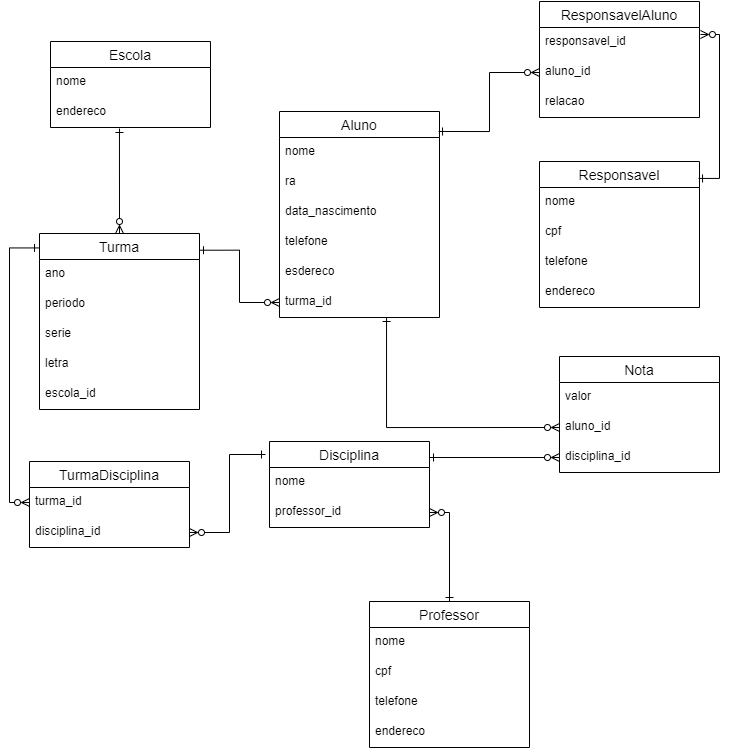

# School API

## Objetivo do sistema
* API que seja capaz de armazenar dados de estudantes no sistema;
* Criar endpoints para: criar, listar, alterar, remover e filtrar estudantes.


## Informações do Projeto

### Modelo do Banco de Dados




## Instalação em ambiente de desenvolvimento

**Pré-requisitos**: Ter instalado as versões mais recentes da linguagem [Python](https://www.python.org/downloads/) e da ferramenta [docker-compose](https://docs.docker.com/compose/install/).

Obs: Usaremos o docker-compose para subir um container com um banco PostgreSQL para desenvolvimento.

1. Criar um arquivo `.env` com base no arquivo `contrib/env-sample`.

2. Criar um ambiente virtual para isolar as dependências que instalaremos

    ```bash
    $ python -m venv .venv --prompt school_api
    ```

3. Ativar o ambiente criado

    No Linux
    ```bash
    $ source .venv/bin/activate
    ```

    Informações sobre ativação em outros Sistemas Operacionais podem ser conferidas em: https://docs.python.org/pt-br/3/library/venv.html


4. Instalar as dependências do sistema

    ```bash
    $ pip install -r requirements-dev.txt
    ```

5. Subir o container com o banco de dados

    ```bash
    $ docker-compose up -d
    ```

6. Executar as migrações para criar toda a estrutura do banco de dados

    ```bash
    $ python manage.py migrate
    ```

7. Rodar o sistema

    ```bash
    $ python manage.py runserver
    ```
    A aplicação estará disponível em: http://localhost:8000/

## Extra

1. Rodar os testes e ver a cobertura
    ```bash
    $ pytest --cov
    ```

2. Rodar o linter
    ```bash
    $ flake8 .
    ```
